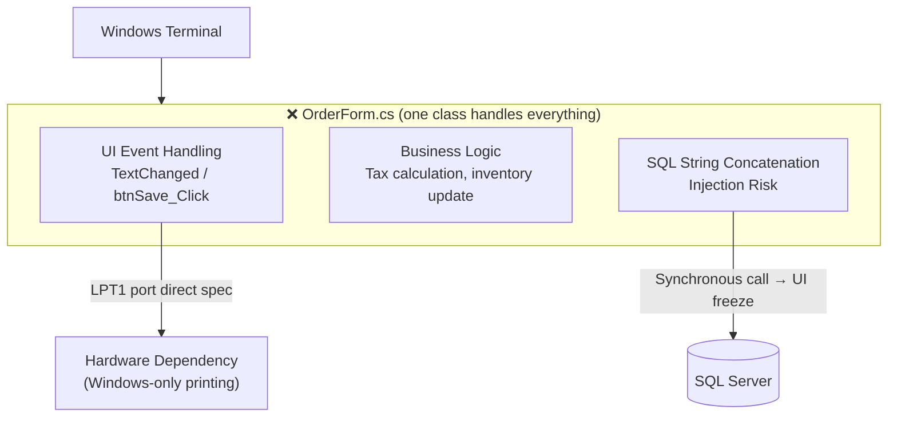
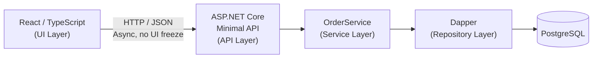
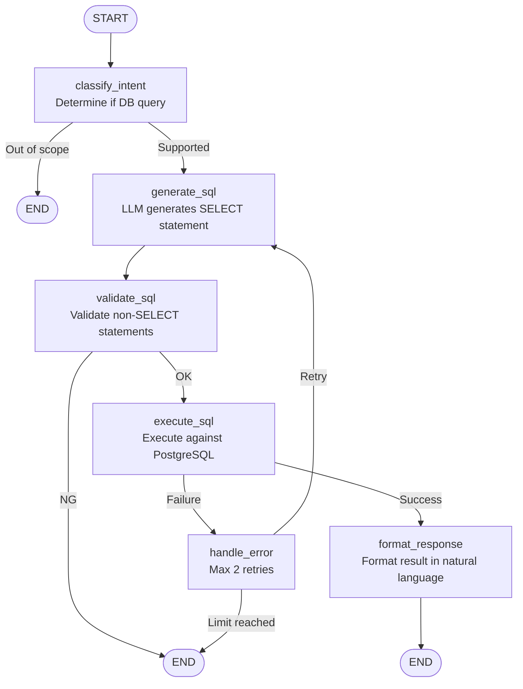
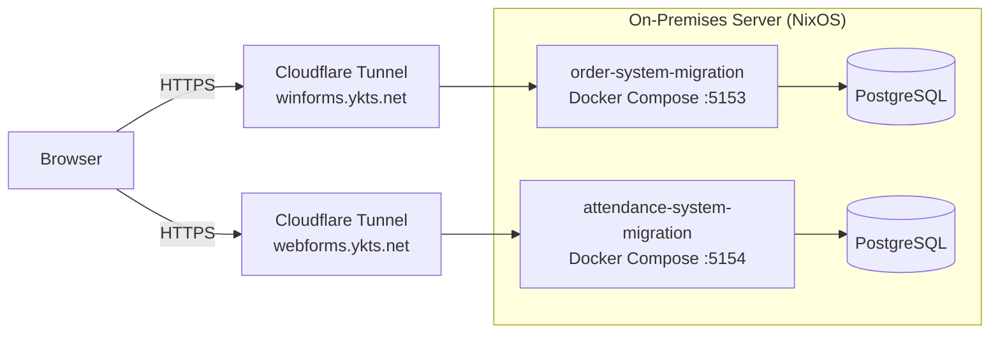

[🇯🇵 日本語](README.md) | [🇬🇧 English](README.en.md)

# .NET WinForms Migration (Order Management System)

[](https://github.com/yktsnet/order-system-migration/actions/workflows/ci.yml)
[](https://github.com/yktsnet/order-system-migration/actions/workflows/deploy.yml)

A sample project for practicing a complete modernization process: step-by-step migration of a legacy Windows business application (WinForms) to `.NET 10 Web API + React`, and further adding a **natural language interface via a Python Agent**.

Sister repo of [attendance-system-migration](https://github.com/yktsnet/attendance-system-migration) (WebForms migration). In addition to dismantling and restructuring WinForms-specific issues (UI freeze, LPT1 dependency, logic concentration in the screen class), this project also covers **additional integration of AI features into a structurally separated architecture**.

---

## Quick Start

### Prerequisites
- [Docker Desktop](https://www.docker.com/products/docker-desktop/)
- .NET SDK 8.0 (for local development)
- Node.js 20+ (for local development)

### Full Setup (Docker only)

```bash
cp .env.example .env  # Fill in GEMINI_API_KEY
docker compose up -d --build
```

- Frontend + API: http://localhost:5153
- Swagger UI: http://localhost:5153/api-docs
- Python Agent: http://localhost:8001

### Local Development (with HMR)

```bash
# 1. Start DB and LocalStack only
docker compose up db localstack -d

# 2. Backend (separate terminal)
cd src/Api && dotnet run

# 3. Frontend (separate terminal)
cd src/Web && npm ci && npm run dev

# 4. Python Agent (separate terminal)
cd src/Agent
pip install -r requirements.txt
uvicorn main:app --reload --port 8001
```

- API: http://localhost:5153
- Frontend (Vite HMR): http://localhost:5173
- Python Agent: http://localhost:8001

---

## 1. Overview and Goals

The goal of this project is not simply rebuilding screens, but presenting the process of **"how to dismantle tightly coupled legacy code and restructure it into a modern architecture."**

**After Demo:** https://winforms.ykts.net  
**API Documentation (Swagger UI):** `/api-docs`

### Key Practices

- **Decode**: Identify issues in code where screens, SQL, and business logic are mixed together
- **Separate**: Decompose responsibilities into UI, Service, and Repository layers
- **Rebuild**: Reconstruct with .NET 10 Web API and React
- **Quality**: Ensure testability and introduce unit tests
- **Extend**: Additional integration of AI features into a structurally separated architecture

---

## 2. Before: The Reality of Legacy Tight Coupling

`legacy/LegacyWinFormsApp/` reproduces the typical legacy business app state where "one class knows too much about everything."

### Business Background

- Order processing was handled entirely in a dedicated desktop app (WinForms) on a Windows terminal
- History review and search were performed on separate terminals and systems
- Monthly aggregation and customer rankings were manually processed in Excel after CSV export
- Answering "What were last month's sales by category?" required the person in charge to open and process Excel

```
+-----------------------------------------------------------+
| [ Order Registration Screen ]                        [×] |
+-----------------------------------------------------------+
| Order No: [ 20260522-001 ]  [ Search (btnSearch) ] ← freezes 2s |
| Customer: [ Osaka Trading Co., Ltd.         ]             |
| Category: [ Office Supplies      ▼ ] ← fetched from DB on open |
| Product:  [ High-Performance Office Chair     ]           |
| -------------------------------------------------------  |
| Unit Price: [ 85,000 ]  Qty: [ 12 ]  Stock: [ Stock: 102 ]|
|                                       ↑ DB call on TextChanged |
| -------------------------------------------------------  |
| Subtotal:  1,020,000                                      |
| Tax:         102,000                                      |
| Total:     1,122,000 ← [ Text turns red over 1M ]        |
| -------------------------------------------------------  |
| [ Save ]  [ Delete ]             [ Print Slip (LPT1) ]   |
| (Save button contains SQL joins, inventory update, transaction) |
+-----------------------------------------------------------+
```

### Key Issues

- **Heavy Processing in UI Events**: Synchronous DB communication in `TextChanged` etc. freezes the UI.
- **SQL Injection Risk**: SQL built by string concatenation.
- **Scattered Domain Logic**: Tax calculation and inventory updates written directly in the screen class — impossible to reuse or test.
- **Hardware Dependency**: Strongly tied to specific execution environments (Windows terminals) such as LPT1 port specifications.



> **About the Before Code**  
> [legacy/LegacyWinFormsApp/OrderForm.cs](legacy/LegacyWinFormsApp/OrderForm.cs) contains actual WinForms code (with comments). No runtime is needed — it serves as a reference for reading the code-level problems.

---

## 3. After Phase 1 — Transition to Modern Architecture

After migration, components are fully separated by responsibility, eliminating Windows environment dependency, UI freezes, and SQL injection risk.

### Migration Approach

- **Complete Separation of UI and Logic**: No direct DB access from screens; all processing via API asynchronously.
- **Introduction of Service Layer**: Tax calculation, inventory check, and transaction management are extracted into `OrderService`, enabling unit testing.
- **Safe Data Access**: SQL injection eliminated with Dapper parameterized queries.
- **Real-time Total Calculation**: Synchronous DB communication in `TextChanged` eliminated. Calculated instantly on the frontend.
- **Portability**: Dockerization removes Windows-only constraints (LPT1, etc.).



### Separation of Calculation Logic (Testability)

`TaxService` is extracted independently from `OrderService`, allowing calculation logic to be tested without a DB connection.

```
OrderService (DB access, transaction management)
    └── TaxService (pure calculation) ← directly tested by xUnit (7 boundary value cases)
```

### Implemented Endpoints

| Method | Path | Description |
|---|---|---|
| GET | `/categories` | Get category master |
| GET | `/orders` | Order history list (filterable by customer name, product name, category, period) |
| GET | `/orders/export` | Order history CSV export (carries filter conditions, UTF-8 BOM, S3 archive) |
| POST | `/orders` | Order registration (inventory update executed within transaction) |
| DELETE | `/orders/{orderNo}` | Order cancellation (inventory auto-restoration executed within transaction) |

> **Why write operations are limited to "registration" and "cancellation"**  
> Allowing modification operations increases the risk of inventory inconsistency from erroneous operations. Prioritizing operational certainty, write-type operations are limited to registration and cancellation only.

---

## 4. After Phase 2 — AI Natural Language Interface

Without structural separation, AI cannot be added as an independent component. Based on the completed Phase 1 separation, this replaces the "CSV → manual Excel aggregation" operation with a natural language interface. The goal is for non-engineers to autonomously check data without going through a person in charge.

### Before / After

| Before (WinForms + Excel) | After (.NET 10 + React + Agent) |
|---|---|
| Filter → CSV export → manual Excel aggregation | Instant answer to natural language questions |
| Customer rankings only apparent after manual processing | Answer with just "What's the ranking?" |
| Cannot handle aggregation axes not pre-built in screens | Any aggregation possible with the same schema |

### Overall Architecture

```
[Phase 1]
React → .NET 10 API → PostgreSQL

[Phase 2 addition]
React → .NET 10 API → PostgreSQL
      ↘
        Python FastAPI (Agent) → LangGraph → PostgreSQL
```

`/chat` requests from React are received by the .NET API and internally forwarded to the Agent (`http://agent:8001`). AI inference responsibilities are separated while keeping the Agent from being directly exposed to the browser.

### LangGraph Flow



### Agent Internal Structure

```
src/Agent/
├── main.py           # FastAPI entry point
├── agent.py          # LangGraph graph definition
├── schema_prompt.py  # DB schema defined as prompt string
├── db.py             # PostgreSQL connection (psycopg2)
├── requirements.txt
├── requirements-dev.txt
├── tests/            # pytest (36 cases)
└── Dockerfile
```

### Key Design Decisions

- **Adopting LangGraph**: Explicitly managing state per node ensures traceability on error (identifying which prompt caused the issue) and future extensibility for model improvement cycles. Note: actual improvement cycle operations are out of this project's scope.
- **LLM is Gemini Flash-lite**: High request limit on the free tier; other models tend to hit limits, making this the only practical choice for this use case. Enables low-cost continuous demo operation.
- **Text-to-SQL (not RAG)**: Inputs are structured fields like "product name, customer, amount" that don't require RAG's complexity. High affinity since the existing system is SQL-based.
- **SELECT statements only**: DDL/DML blocked at the `validate_sql` node, eliminating DB side effects.
- **Max 2 retries**: Returns to `generate_sql` on SQL execution failure, feeding error details back to the LLM.
- **Agent logging**: Records to the `AgentLog` table at flow completion. Used for understanding failure patterns in generated SQL and auditing abnormal SQL.
- **Maintaining separation of concerns**: Natural language interface integrated without touching business logic.

### Example Queries

- "How many orders were there last month?"
- "Tell me total sales by category"
- "What are the top 3 customers by sales?"
- "What is the highest unit price product this month?"
- "What products have stock below 50?"

---

## 5. Tech Stack

| Layer | Technology | Reason |
|---|---|---|
| **Frontend** | React, TypeScript, Vite, Tailwind CSS | SPA handling both order operations and AI chat. Combines type safety with fast builds |
| **Backend** | .NET 10 (Minimal API), xUnit | Inherits C#/WinForms language assets, restructured as a lightweight API. Tax calculation guaranteed by boundary value tests |
| **AI Agent** | Python, FastAPI, LangGraph, Gemini API | Text-to-SQL execution managed with a graph for traceable errors. Gemini's free tier has high limits — optimal for verification scale |
| **Database** | PostgreSQL (Dapper / psycopg2) | High affinity with the existing SQL-based system. .NET side uses Dapper, Agent side uses psycopg2 |
| **Object Storage** | LocalStack (AWS S3 compatible) | Switchable to production S3 by just changing `AWS__ServiceURL`. Enables local verification before deployment |
| **Infrastructure** | Docker Compose, Terraform, Cloudflare Tunnel, GitHub Actions, NixOS (on-premises) | 3 services started at once with compose. IaC, CI/CD, and always-on demo built by one person |

---

## 6. Modernization Policy

1. **Lightweight Logic Extraction (Minimal API)**: Decompose the massive `OrderForm.cs` into a loosely coupled Web API.
2. **Environment Abstraction (IaC)**: Use Terraform to eliminate dependency on specific server environments.
3. **Portability (Docker)**: Break the "only runs on Windows" constraint and open the path to the cloud. LocalStack-based storage pre-verification also completes within the same stack.
4. **Safety Net (Unit Tests)**: Equipment for refactoring without breaking existing functionality. Both layers covered by xUnit (.NET 7 boundary value cases) and pytest (Agent 36 cases).
5. **CI/CD Pipelining (GitHub Actions)**: Automatically runs build and tests (.NET, React, Python Agent) on every push for continuous quality assurance.
6. **Ease of AI Integration**: In a structurally separated architecture, AI services can be added as independent components. Integrating a natural language interface without touching business logic is proof of this.

> **Focus & Scope**  
> This project specializes in **"dismantling legacy assets and structural separation."**  
> Full authentication/authorization implementation, production DB redundancy, and conversation history management are **Out of Scope**.
>
> **About Agent Authentication**  
> The Python Agent is exposed only within the Docker network. `/chat` requests from browsers are relayed by the .NET API and forwarded to the Agent at `http://agent:8001`. The Agent is not directly exposed externally.

---

## 7. Demo Operations

**After Demo:** https://winforms.ykts.net

[attendance-system-migration](https://github.com/yktsnet/attendance-system-migration) (WebForms After) and this repo (WinForms After) each have independent Cloudflare Tunnels and **both run continuously**.



### Deployment Design

This project's deployment adopts a **"push-style deployment"** that rsyncs to the server from GitHub Actions via Tailscale and runs `docker compose up --build`.

* GitHub Actions triggered by push to main branch
* After tests pass, SSH connection via Tailscale VPN to transfer source
* Server-side runs `docker compose up -d --build` to update containers

### Deployment Steps (Initial)

Pushing to the main branch triggers automatic deployment via GitHub Actions (rsync via Tailscale + `docker compose up --build`).  
Required GitHub Secrets (deploy host, SSH key, Tailscale OAuth, `GEMINI_API_KEY`, etc.) are managed in repository operations documentation (not included in README).

For manual deployment:

```bash
cp .env.example .env  # Fill in GEMINI_API_KEY
./infrastructure/deploy.sh
```

---

## 8. Comparison with attendance-system-migration

| | order-system-migration (this repo) | [attendance-system-migration](https://github.com/yktsnet/attendance-system-migration) |
|---|---|---|
| **Before** | WinForms (desktop) | WebForms (legacy web) |
| **Nature of Issues** | Problems that surface at runtime | Structural debt that accumulates while running |
| **Legacy-Specific Issues** | UI freeze, LPT1 dependency | AutoPostBack, ViewState |
| **Business Domain** | Order management | Attendance management |
| **Phase 2 Extension** | AI natural language interface | SignalR real-time features |
| **Common Issues** | Code-behind tight coupling, SQL injection, untestable code ||

---

## 9. Directory Structure

```
.
├── .github/
│   └── workflows/
│       ├── ci.yml                        # CI (.NET tests, React build, Python Agent tests)
│       └── deploy.yml                    # Deploy (rsync via Tailscale + docker compose up)
├── docs/
│   └── design.md                         # UI design policy (colors, component rules)
├── infrastructure/
│   ├── db/
│   │   ├── init/
│   │   │   └── 01_schema.sql             # DB initialization (table definitions including AgentLog)
│   │   └── seed/
│   │       ├── generate_seed.py          # Sample data generation script
│   │       └── 02_seed.sql               # Pre-generated sample data (400 records, 6 months)
│   ├── localstack/
│   │   └── init/
│   │       └── 01_create_bucket.sh       # Auto-creates bucket after LocalStack starts
│   ├── deploy.sh                         # Mac → server deploy (rsync, docker compose up)
│   ├── db-init.sh                        # DB initialization (first time only)
│   ├── db-seed.sh                        # Sample data insertion
│   ├── main.tf                           # Terraform definition (for AWS ECS/RDS/S3 environment setup)
├── legacy/
│   └── LegacyWinFormsApp/
│       └── OrderForm.cs                  # Before (unchanged, code-level problem reference)
├── src/
│   ├── Agent/                            # Phase 2: Python FastAPI + LangGraph AI Agent
│   │   ├── main.py
│   │   ├── agent.py
│   │   ├── schema_prompt.py
│   │   ├── db.py
│   │   ├── requirements.txt
│   │   ├── requirements-dev.txt
│   │   ├── tests/                        # pytest (36 cases, LLM/DB mocked)
│   │   └── Dockerfile
│   ├── Api/                              # After: .NET 10 Minimal API
│   │   ├── Endpoints/
│   │   ├── Services/
│   │   │   ├── OrderService.cs
│   │   │   └── TaxService.cs
│   │   ├── Program.cs
│   │   └── Dockerfile
│   ├── Api.Tests/                        # xUnit tests
│   │   └── OrderServiceTests.cs          # TaxService boundary value tests (no DB, 7 cases)
│   └── Web/                              # After: React Frontend
│       └── src/
│           ├── App.tsx
│           ├── ChatPanel.tsx
│           └── types.ts
├── docker-compose.yml
└── README.md
```

## How this was built

Development follows an issue-driven workflow that separates design (interactive AI), implementation (autonomous AI), and verification (human merge). An AI agent implements each change starting from an issue file, and dangerous operations are blocked by configuration rather than by convention. The setup lives in [dotfiles-public](https://github.com/yktsnet/dotfiles-public); the process itself is visible in this repository's issues and PRs.
