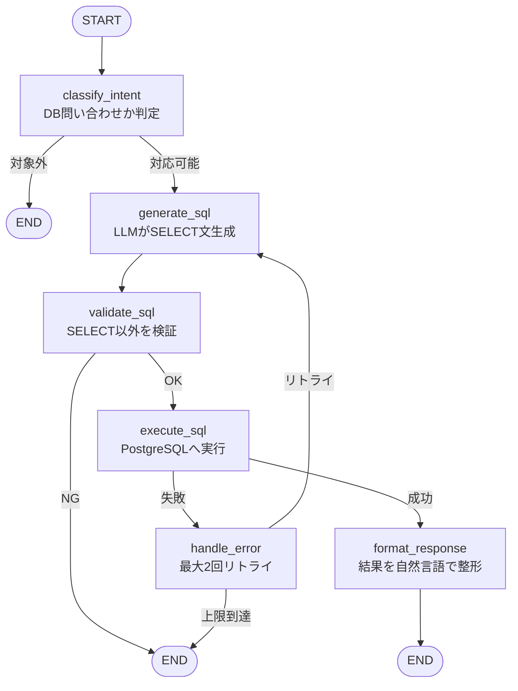

# .NET WinForms Migration

[](https://github.com/kyamakawa-widget/dotnet-modernization-lab/actions/workflows/ci.yml)

レガシーな Windows 業務アプリ（WinForms）を題材に、`.NET 8 Web API + React` への段階的移行、さらに **Python Agent による自然言語インターフェース** の追加まで、一連のモダナイゼーション・プロセスを実践するためのサンプルプロジェクトです。

---

## 1. 概要とゴール

本プロジェクトの目的は、単なる画面の作り替えではなく、**「密結合なレガシーコードをいかに解体し、モダンなアーキテクチャへ再構成するか」** のプロセスを提示することにあります。

**Demo:** https://preceding-camel-remains-traveler.trycloudflare.com/  
**API ドキュメント (Swagger UI):** https://preceding-camel-remains-traveler.trycloudflare.com/api-docs

### 実践のポイント

- **解読**: 画面・SQL・業務ロジックが混在したコードの課題特定
- **分離**: UI、Service、Repository、データアクセス層への構造分離
- **刷新**: .NET 8 Web API と React による最新スタックへの移行
- **品質**: テスタビリティの確保と単体テストの導入
- **拡張**: 責務分離が完了した構造への AI 機能の追加統合

---

## 2. Before: レガシーな密結合の実態

`legacy/LegacyWinFormsApp/` では、古い業務アプリに典型的な「1つのクラスがすべてを知りすぎている」状態を再現しています。

### 業務の背景

- 発注業務は Windows 端末上の専用アプリ（WinForms）で完結していた
- 履歴確認・検索は別端末・別システムで行っていた
- 月次集計・得意先ランキング等の分析は、CSV エクスポート後に Excel で手動加工していた
- 「先月カテゴリ別の売上は？」の問いに答えるには、担当者が Excel を開いて加工する必要があった

### 構成イメージ

```
+-----------------------------------------------------------+
| [ 受注登録画面 ]                                     [×] |
+-----------------------------------------------------------+
| 受注番号: [ 20260522-001 ]  [ 検索(btnSearch) ] ← 2秒固まる |
| 得意先名: [ 株式会社大阪商事         ]                    |
| カテゴリ: [ 事務用品          ▼ ] ← 画面起動時にDBから取得 |
| 商品名称: [ 高性能オフィスチェア      ]                    |
| -------------------------------------------------------  |
| 単価: [ 85,000 ]  数量: [ 12 ]  在庫: [ 在庫：102 ]       |
|                                     ↑ TextChangedでDB通信 |
| -------------------------------------------------------  |
| 小計:   1,020,000 円                                      |
| 消費税:   102,000 円                                      |
| 合計:   1,122,000 円 ← [ 100万超えで文字が赤くなる ]      |
| -------------------------------------------------------  |
| [ 保存 ]  [ 削除 ]               [ 伝票印刷(LPT1) ]      |
| (保存ボタンの中に、SQL結合・在庫更新・トランザクションが全入り) |
+-----------------------------------------------------------+
```

### 主な課題点

- **UI イベント内の重い処理**: `TextChanged` 等での同期 DB 通信により UI がフリーズする。
- **SQL インジェクションのリスク**: 文字列結合による SQL 組み立て。
- **ドメインロジックの散逸**: 税計算や在庫更新が画面クラスに直接記述され、再利用やテストが不能。
- **ハードウェア依存**: LPT1 ポート指定など、特定の実行環境（Windows 端末）に強く依存。

---

## 3. After: モダンアーキテクチャへの転換

移行後は、責務に応じてコンポーネントを完全に分離し、Web 標準の技術スタックで再構築します。

### 全体構成

```
【Phase 1】
React → .NET 8 API → PostgreSQL

【Phase 2 追加】
React → .NET 8 API → PostgreSQL
      ↘
        Python FastAPI (Agent) → LangGraph → PostgreSQL
```

- **.NET 8 API**: 業務ロジック（登録・削除・在庫更新・CSV エクスポート）を担当。
- **Python FastAPI**: AI 推論のみを担当する独立サービス。
- **React**: 業務ロジックと AI 推論の責務を分離したまま、それぞれのバックエンドと直接通信。

### 移行アプローチ

- **UI とロジックの完全分離**: 画面から DB へ直接アクセスせず、すべて API 経由で非同期に処理。
- **Service 層の導入**: 税計算や在庫確認を独立したクラスへ切り出し、単体テストを可能にする。
- **安全なデータアクセス**: パラメータ化クエリ（Dapper）を使用。
- **ポータビリティ**: Docker 化により、実行環境に依存しないデプロイを実現。

### 実装された主な API エンドポイント

#### .NET 8 API（業務ロジック）

| Method | Path | 説明 |
| ------ | ---- | ---- |
| GET | `/categories` | カテゴリマスタ取得 |
| GET | `/orders` | 受注履歴一覧取得（得意先名・商品名・カテゴリ・期間でフィルタ可） |
| GET | `/orders/export` | 受注履歴 CSV エクスポート（フィルタ条件を引き継ぎ） |
| POST | `/orders` | 受注登録（在庫更新をトランザクション内で実行） |
| DELETE | `/orders/{orderNo}` | 受注取消（在庫自動復元をトランザクション内で実行） |

#### Python FastAPI（AI Agent）

| Method | Path | 説明 |
| ------ | ---- | ---- |
| POST | `/chat` | 自然言語による受注データへの問い合わせ（SQL 生成・実行・回答整形） |

### 実装された主な機能

- **注文履歴の可視化**: 過去の受注データを一覧で確認できる「注文履歴」タブを新設。
- **履歴の検索・フィルタ**: 得意先名・商品名（部分一致）、カテゴリ、期間を組み合わせて絞り込み可能。
- **CSV エクスポート**: フィルタ条件を維持したまま受注履歴を CSV でダウンロード。Excel で直接開ける UTF-8 BOM 付き。
- **安全な取消処理**: 履歴一覧からの削除アクションに連動し、API のトランザクション内で在庫の自動復元を安全に実行。
- **自然言語データ分析**: 「先月の得意先ランキングは？」のような問いに、フィルタ操作・Excel 加工なしで即答を返す「データ分析」タブ。

---

## 4. Phase 2: 自然言語インターフェース

### Before / After

```
Phase 1 まで:
  フィルタを画面で指定 → 絞り込み結果を目視
  CSV エクスポート → Excel で手動集計 → 答えを得る

Phase 2:
  「先月の得意先ランキングは？」と自然言語で問う
  フィルタ操作・Excel 加工なしで即答が返る
  事前に画面を作っていない切り口の集計にも対応できる
```

### LangGraph フロー



### Agent の内部構成

```
src/Agent/
├── main.py           # FastAPI エントリポイント
├── agent.py          # LangGraph グラフ定義
├── schema_prompt.py  # DB スキーマをプロンプト文字列で定義
├── db.py             # PostgreSQL 接続（psycopg2）
├── requirements.txt
└── Dockerfile
```

### 主な設計判断

- **LLM は Gemini API (`gemini-3.1-flash-lite`)**: 低コストでデモ環境を継続稼働できる。
- **SELECT 文のみ許可**: `validate_sql` ノードで DDL/DML を弾き、DB への副作用を排除。
- **リトライ最大 2 回**: SQL 実行失敗時に `generate_sql` へ戻り、エラー内容を LLM へフィードバック。
- **エージェントログ**: フロー終了時に `AgentLog` テーブルへ結果を記録。生成 SQL の失敗パターン把握・質問傾向分析・異常 SQL の監査に使用。
- **責務分離の維持**: React は .NET API と Python Agent に直接通信。AI 推論を .NET 経由にせず、業務ロジックと推論の責務を明確に分離したまま維持。

### 対応する質問例

- 「先月の受注件数は？」
- 「カテゴリ別の売上合計を教えて」
- 「得意先ランキングトップ3は？」
- 「今月一番高い単価の商品は？」
- 「在庫が 50 以下の商品は？」

---

## 5. 技術スタック

| Layer              | Technology                             |
| ------------------ | -------------------------------------- |
| **Frontend**       | React, TypeScript, Vite, Tailwind CSS  |
| **Backend**        | .NET 8 (Minimal API), xUnit            |
| **AI Agent**       | Python, FastAPI, LangGraph, Gemini API |
| **Database**       | PostgreSQL (Dapper / psycopg2)         |
| **Object Storage** | LocalStack (AWS S3 互換)               |
| **Infrastructure** | Docker Compose, Terraform, Cloudflare Tunnel |

---

## 6. モダナイゼーションの方針

本プロジェクトでは、単なるコード書き換えではなく、以下の 7 つの柱を軸に「開発プロセス」の移行を実践します。

1. **ロジックの軽量抽出 (Minimal API)**: 巨大な `code-behind` を疎結合な Web API へ分解。
2. **環境の抽象化 (IaC)**: Terraform を用い、特定のサーバー環境への依存を排除。
3. **ポータビリティ (Docker)**: 「Windows でしか動かない」制約を破壊し、クラウドへの道を確保。
4. **セーフティネット (Unit Test)**: 既存機能を壊さずにリファクタリングするための武器を装備。
5. **検証容易性の確保**: Service 層と単体テストにより、変更時の影響を確認しやすくする。
6. **CI/CD のパイプライン化 (GitHub Actions)**: 自動でビルド・テストを実行し、品質を継続的に担保する仕組みを導入。
7. **AI 統合の容易化**: 責務分離が完了した構造では、AI サービスを独立したコンポーネントとして追加できる。業務ロジックに手を入れることなく自然言語インターフェースを統合したことがその実証。

> **Focus & Scope**  
> 本プロジェクトは **「レガシー資産の解体と構造分離」** に特化しています。  
> 「認証・認可 (Auth0 等)」「本番用 DB の冗長化構成」「ストリーミングレスポンス」「複数ターンの会話履歴管理」などは **対象外 (Out-of-Scope)** としています。

> **インフラ補足**  
>
> **ローカル開発**: `docker-compose.yml` で全サービス（.NET API / Python Agent / PostgreSQL / LocalStack）を一括起動。  
> サンプルデータは DB 起動後に `infrastructure/db-seed.sh` を別途実行して投入する。  
>
> **VPS デプロイ（通常）**: `infrastructure/deploy.sh`（WSL から rsync + systemctl）で .NET API と Agent をデプロイ・再起動。  
> **VPS 初回セットアップ**: `infrastructure/agent-setup.sh` を VPS 上で実行。Python venv の構築・依存ライブラリのインストール・systemd ユニット（`modernization-agent.service`）の登録までを自動化。  
>
> 本番想定では Cloudflare Zero Trust による独自ドメイン＋アクセス制御、または Terraform 定義を AWS (ECS/RDS/S3) へ拡張してデプロイ。

---

## 7. ディレクトリ構造

```
.
├── .github/
│   └── workflows/               # CI/CD パイプライン定義（GitHub Actions: 自動ビルド・テスト）
├── docs/
│   ├── architecture.md          # アーキテクチャ図（Mermaid）
│   ├── design.md                # UI デザイン方針（カラー・コンポーネント規則）
│   └── migration-plan.md        # 移行フェーズ定義
├── infrastructure/              # IaC・インフラストラクチャ定義
│   ├── db/
│   │   ├── init/
│   │   │   └── 01_schema.sql        # DB 初期化 SQL（AgentLog テーブル含む）
│   │   └── seed/
│   │       ├── generate_seed.py     # サンプルデータ生成スクリプト
│   │       └── 02_seed.sql          # 生成済みサンプルデータ（400件・6ヶ月分）
│   ├── agent-setup.sh           # VPS 初回セットアップ（venv 構築・systemd ユニット登録）
│   ├── deploy.sh                # WSL → VPS デプロイスクリプト（ビルド・転送・再起動）
│   ├── db-init.sh               # DB 初期化スクリプト（初回のみ実行）
│   ├── db-seed.sh               # サンプルデータ投入スクリプト
│   ├── main.tf                  # Terraform 定義（AWS ECS/RDS/S3 等の環境構築用）
│   ├── ci.sh                    # CI/デプロイ支援スクリプト
│   └── webhook_listener.py      # Webhook 受信・処理スクリプト
├── legacy/
│   └── LegacyWinFormsApp/       # Before: 密結合な WinForms 業務アプリのサンプルコード
├── src/
│   ├── Agent/                   # Phase 2: Python FastAPI + LangGraph AI Agent
│   ├── Api/                     # After: .NET 8 Web API (Minimal API / Service 層)
│   ├── Api.Tests/               # xUnit による Service 層の単体テスト
│   └── Web/                     # After: React Frontend (Vite / TypeScript / Tailwind CSS)
├── docker-compose.yml           # ローカル開発用コンテナ構成（API / Agent / PostgreSQL / LocalStack）
```
