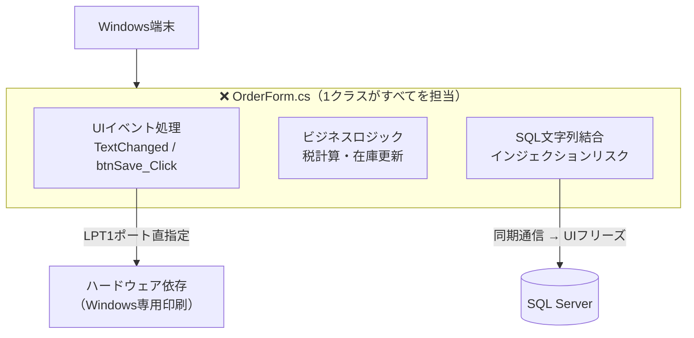
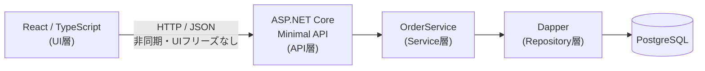
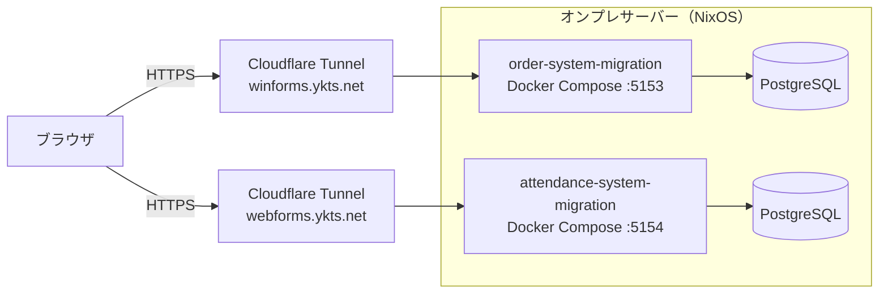

[🇯🇵 日本語](README.md) | [🇬🇧 English](README.en.md)

# .NET WinForms Migration (Order Management System)

[](https://github.com/yktsnet/order-system-migration/actions/workflows/ci.yml)
[](https://github.com/yktsnet/order-system-migration/actions/workflows/deploy.yml)

レガシーな Windows 業務アプリ（WinForms）を題材に、`.NET 8 Web API + React` への段階的移行、さらに **Python Agent による自然言語インターフェース** の追加まで、一連のモダナイゼーション・プロセスを実践するためのサンプルプロジェクト。

[attendance-system-migration](https://github.com/yktsnet/attendance-system-migration)（WebForms 移行）の姉妹リポ。WinForms 固有の問題（UI フリーズ・LPT1 依存・画面クラスへのロジック集中）の解体と再構成に加え、**責務分離が完了した構造への AI 機能の追加統合**まで扱う。

---

## Quick Start

### Prerequisites
- [Docker Desktop](https://www.docker.com/products/docker-desktop/)
- .NET SDK 8.0（ローカル開発時）
- Node.js 20+（ローカル開発時）

### Full Setup (Docker only)

```bash
cp .env.example .env  # GEMINI_API_KEY を記入
docker compose up -d --build
```

- Frontend + API: http://localhost:5153
- Swagger UI: http://localhost:5153/api-docs
- Python Agent: http://localhost:8001

### Local Development (with HMR)

```bash
# 1. DB・LocalStack のみ起動
docker compose up db localstack -d

# 2. バックエンド（別ターミナル）
cd src/Api && dotnet run

# 3. フロントエンド（別ターミナル）
cd src/Web && npm ci && npm run dev

# 4. Python Agent（別ターミナル）
cd src/Agent
pip install -r requirements.txt
uvicorn main:app --reload --port 8001
```

- API: http://localhost:5153
- Frontend (Vite HMR): http://localhost:5173
- Python Agent: http://localhost:8001

---

## 1. Overview and Goals

本プロジェクトの目的は、単なる画面の作り替えではなく、**「密結合なレガシーコードをいかに解体し、モダンなアーキテクチャへ再構成するか」** のプロセスを提示することにある。

**After Demo:** https://winforms.ykts.net  
**API ドキュメント (Swagger UI):** `/api-docs`

### Key Practices

- **解読**: 画面・SQL・業務ロジックが混在したコードの課題特定
- **分離**: UI、Service、Repository 層への責務分離
- **刷新**: .NET 8 Web API と React による再構築
- **品質**: テスタビリティの確保と単体テストの導入
- **拡張**: 責務分離が完了した構造への AI 機能の追加統合

---

## 2. Before: The Reality of Legacy Tight Coupling

`legacy/LegacyWinFormsApp/` では、古い業務アプリに典型的な「1つのクラスがすべてを知りすぎている」状態を再現。

### Business Background

- 発注業務は Windows 端末上の専用アプリ（WinForms）で完結していた
- 履歴確認・検索は別端末・別システムで行っていた
- 月次集計・得意先ランキング等の分析は、CSV エクスポート後に Excel で手動加工していた
- 「先月カテゴリ別の売上は？」の問いに答えるには、担当者が Excel を開いて加工する必要があった

```
+-----------------------------------------------------------+
| [ 受注登録画面 ]                                     [×] |
+-----------------------------------------------------------+
| 受注番号: [ 20260522-001 ]  [ 検索(btnSearch) ] ← 2秒固まる |
| 得意先名: [ 株式会社大阪商事         ]                    |
| カテゴリ: [ 事務用品          ▼ ] ← 画面起動時にDBから取得 |
| 商品名称: [ 高性能オフィスチェア      ]                    |
| -------------------------------------------------------  |
| 単価: [ 85,000 ]  数量: [ 12 ]  在庫: [ 在庫：102 ]       |
|                                     ↑ TextChangedでDB通信 |
| -------------------------------------------------------  |
| 小計:   1,020,000 円                                      |
| 消費税:   102,000 円                                      |
| 合計:   1,122,000 円 ← [ 100万超えで文字が赤くなる ]      |
| -------------------------------------------------------  |
| [ 保存 ]  [ 削除 ]               [ 伝票印刷(LPT1) ]      |
| (保存ボタンの中に、SQL結合・在庫更新・トランザクションが全入り) |
+-----------------------------------------------------------+
```

### Key Issues

- **UI イベント内の重い処理**: `TextChanged` 等での同期 DB 通信により UI がフリーズする。
- **SQL インジェクションのリスク**: 文字列結合による SQL 組み立て。
- **ドメインロジックの散逸**: 税計算や在庫更新が画面クラスに直接記述され、再利用やテストが不能。
- **ハードウェア依存**: LPT1 ポート指定など、特定の実行環境（Windows 端末）に強く依存。



> **Before コードについて**  
> [legacy/LegacyWinFormsApp/OrderForm.cs](legacy/LegacyWinFormsApp/OrderForm.cs) には実際の WinForms コード（コメント付き）を収録。実行環境は不要で、コードレベルの問題を読み取るためのリファレンスとして機能する。

---

## 3. After Phase 1 — Transition to Modern Architecture

移行後は責務に応じてコンポーネントを完全に分離し、Windows 環境依存・UI フリーズ・SQL インジェクションリスクを排除する。

### Migration Approach

- **UI とロジックの完全分離**: 画面から DB へ直接アクセスせず、すべて API 経由で非同期処理。
- **Service 層の導入**: 税計算・在庫確認・トランザクション管理を `OrderService` へ切り出し、単体テストを可能にする。
- **安全なデータアクセス**: Dapper のパラメータ化クエリで SQL インジェクションを根絶。
- **合計のリアルタイム計算**: `TextChanged` での同期 DB 通信を廃止。フロント側で即時計算。
- **ポータビリティ**: Docker 化により、Windows 専用制約（LPT1 等）を排除。



### Separation of Calculation Logic (Testability)

`TaxService` を `OrderService` から独立させ、DB 接続なしで計算ロジック単体をテスト可能にしている。

```
OrderService（DBアクセス・トランザクション管理）
    └── TaxService（純粋計算）← xUnit が直接テスト（境界値 7 ケース）
```

### Implemented Endpoints

| Method | Path | 説明 |
|---|---|---|
| GET | `/categories` | カテゴリマスタ取得 |
| GET | `/orders` | 受注履歴一覧（得意先名・商品名・カテゴリ・期間でフィルタ可） |
| GET | `/orders/export` | 受注履歴 CSV エクスポート（フィルタ条件を引き継ぎ・UTF-8 BOM・S3 アーカイブ保存） |
| POST | `/orders` | 受注登録（在庫更新をトランザクション内で実行） |
| DELETE | `/orders/{orderNo}` | 受注取消（在庫自動復元をトランザクション内で実行） |

> **書き込み操作を「登録」と「取消」に限定している理由**  
> 修正操作を許容すると誤操作による在庫不整合のリスクが高まる。操作の確実性を優先し、更新系は登録と取消のみに絞った。

---

## 4. After Phase 2 — AI Natural Language Interface

密結合のままでは AI を独立したコンポーネントとして追加できない。Phase 1 の分離が完了した構造を前提に、「CSV → Excel 手動集計」という運用を自然言語インターフェースで置き換える。非エンジニアが担当者を介さず自律的にデータ確認できる状態を目指す。

### Before / After

| Before (WinForms + Excel) | After (.NET 8 + React + Agent) |
|---|---|
| フィルタ操作 → CSV エクスポート → Excel 手動集計 | 自然言語で問うと即答が返る |
| 得意先ランキングは担当者が加工して初めて判明 | 「ランキングは？」の一言で回答 |
| 事前に画面を作っていない集計軸には対応不可 | スキーマが同じなら任意の集計が可能 |

### Overall Architecture

```
【Phase 1】
React → .NET 8 API → PostgreSQL

【Phase 2 追加】
React → .NET 8 API → PostgreSQL
      ↘
        Python FastAPI (Agent) → LangGraph → PostgreSQL
```

React からの `/chat` リクエストは .NET API が受け取り、内部で Agent（`http://agent:8001`）へ転送する。AI 推論の責務を分離したまま、ブラウザから直接 Agent を公開しない構成。

### LangGraph Flow


### Agent Internal Structure

```
src/Agent/
├── main.py           # FastAPI エントリポイント
├── agent.py          # LangGraph グラフ定義
├── schema_prompt.py  # DB スキーマをプロンプト文字列で定義
├── db.py             # PostgreSQL 接続（psycopg2）
├── requirements.txt
├── requirements-dev.txt
├── tests/            # pytest（36 ケース）
└── Dockerfile
```

### Key Design Decisions

- **LangGraph を採用**: ノード単位で状態を明示管理することで、エラー発生時の追跡性（どのプロンプトが原因かの特定）と、将来的なモデル改善サイクルへの発展性を確保。なお実際の改善サイクル運用は本プロジェクトのスコープ外。
- **LLM は Gemini 3.1 Flash-lite**: 無料枠でリクエスト上限が高く、他モデルは制限に達しやすいため本要件では一択。低コストでデモ環境を継続稼働できる。
- **Text-to-SQL（RAG ではない）**: 入力が「商品名・得意先・金額」等の構造化済みフィールドであり、RAG ほどの複雑さを必要としない規模感。既存システムが SQL ベースで構築されている点でも親和性が高い。
- **SELECT 文のみ許可**: `validate_sql` ノードで DDL/DML を弾き、DB への副作用を排除。
- **リトライ最大 2 回**: SQL 実行失敗時に `generate_sql` へ戻り、エラー内容を LLM へフィードバック。
- **エージェントログ**: フロー終了時に `AgentLog` テーブルへ記録。生成 SQL の失敗パターン把握・異常 SQL の監査に使用。
- **責務分離の維持**: 業務ロジックに手を入れることなく自然言語インターフェースを統合。

### Example Queries

- 「先月の受注件数は？」
- 「カテゴリ別の売上合計を教えて」
- 「得意先ランキングトップ3は？」
- 「今月一番高い単価の商品は？」
- 「在庫が 50 以下の商品は？」

---

## 5. Tech Stack

| Layer | Technology | Reason |
|---|---|---|
| **Frontend** | React, TypeScript, Vite, Tailwind CSS | 受注操作と AI チャットの2系統を扱う SPA。型安全と高速ビルドを両立 |
| **Backend** | .NET 8 (Minimal API), xUnit | 移行元 C#/WinForms の言語資産を引き継ぎ軽量 API へ再構成。税計算は境界値テストで担保 |
| **AI Agent** | Python, FastAPI, LangGraph, Gemini API | Text-to-SQL の実行をグラフで管理しエラー原因を追跡可能に。Gemini は無料枠の上限が高く検証規模に最適 |
| **Database** | PostgreSQL (Dapper / psycopg2) | 既存が SQL ベースで親和性が高い。.NET 側は Dapper、Agent 側は psycopg2 |
| **Object Storage** | LocalStack (AWS S3 互換) | `AWS__ServiceURL` の差し替えのみで本番 S3 へ移行可能。デプロイ前にローカルで検証できる |
| **Infrastructure** | Docker Compose, Terraform, Cloudflare Tunnel, GitHub Actions, NixOS (オンプレ) | 3サービスを compose で一括起動。IaC・CI/CD・常時公開まで一人で構築 |

---

## 6. Modernization Policy

1. **ロジックの軽量抽出 (Minimal API)**: 巨大な `OrderForm.cs` を疎結合な Web API へ分解。
2. **環境の抽象化 (IaC)**: Terraform を用い、特定のサーバー環境への依存を排除。
3. **ポータビリティ (Docker)**: 「Windows でしか動かない」制約を破壊し、クラウドへの道を確保。LocalStack によるストレージの事前検証も同一スタック内で完結する。
4. **セーフティネット (Unit Test)**: 既存機能を壊さずにリファクタリングするための武器を装備。xUnit（.NET 境界値 7 ケース）と pytest（Agent 36 ケース）で両レイヤーをカバー。
5. **CI/CD のパイプライン化 (GitHub Actions)**: push ごとにビルド・テスト（.NET・React・Python Agent）を自動実行し、品質を継続的に担保。
6. **AI 統合の容易化**: 責務分離が完了した構造では、AI サービスを独立したコンポーネントとして追加できる。業務ロジックに手を入れることなく自然言語インターフェースを統合したことがその実証。

> **Focus & Scope**  
> 本プロジェクトは **「レガシー資産の解体と構造分離」** に特化。  
> 認証・認可の本格実装・本番用 DB の冗長化構成・会話履歴管理は **対象外 (Out-of-Scope)**。
>
> **Agent の認証について**  
> Python Agent は Docker ネットワーク内部にのみ公開。ブラウザからの `/chat` リクエストは .NET API が中継し、Agent へは `http://agent:8001` で転送する。Agent を外部に直接露出しない構成。

---

## 7. Demo Operations

**After Demo:** https://winforms.ykts.net

[attendance-system-migration](https://github.com/yktsnet/attendance-system-migration)（WebForms After）と本リポ（WinForms After）はそれぞれ独立した Cloudflare Tunnel を持ち、**両方常時稼働**する。



### Deployment Design

本プロジェクトのデプロイは、GitHub Actions から Tailscale 経由で SV6 に rsync し、`docker compose up --build` を実行する **「プッシュ型デプロイ方式」** を採用しています。

* main ブランチへの push をトリガーに GitHub Actions が起動
* テスト通過後、Tailscale VPN 経由で SSH 接続しソースを転送
* サーバー側で `docker compose up -d --build` を実行してコンテナを更新

### Deployment Steps (Initial)

main ブランチへの push で GitHub Actions が自動デプロイ（Tailscale 経由 rsync + `docker compose up --build`）。
必要な GitHub Secrets（デプロイ先ホスト・SSH 鍵・Tailscale OAuth・`GEMINI_API_KEY` 等）はリポジトリ運用ドキュメントで管理する（README には記載しない）。

手動デプロイが必要な場合:

```bash
cp .env.example .env  # GEMINI_API_KEY を記入
./infrastructure/deploy.sh
```

---

## 8. Comparison with attendance-system-migration

| | order-system-migration（本リポ） | [attendance-system-migration](https://github.com/yktsnet/attendance-system-migration) |
|---|---|---|
| **Before** | WinForms（デスクトップ） | WebForms（レガシー Web） |
| **問題の性質** | 実行時に表面化する問題 | 稼働しながら蓄積する構造的負債 |
| **レガシー固有の問題** | UI フリーズ・LPT1 依存 | AutoPostBack・ViewState |
| **業務ドメイン** | 受注管理 | 勤怠管理 |
| **Phase 2 の拡張** | AI 自然言語インターフェース | SignalR リアルタイム機能 |
| **共通の問題** | コードビハインド密結合・SQL インジェクション・テスト不能 ||

---

## 9. Directory Structure

```
.
├── .github/
│   └── workflows/
│       ├── ci.yml                        # CI（.NET テスト・React ビルド・Python Agent テスト）
│       └── deploy.yml                    # Deploy（Tailscale 経由 rsync + docker compose up）
├── docs/
│   └── design.md                         # UI デザイン方針（カラー・コンポーネント規則）
├── infrastructure/
│   ├── db/
│   │   ├── init/
│   │   │   └── 01_schema.sql             # DB 初期化（テーブル定義・AgentLog 含む）
│   │   └── seed/
│   │       ├── generate_seed.py          # サンプルデータ生成スクリプト
│   │       └── 02_seed.sql               # 生成済みサンプルデータ（400件・6ヶ月分）
│   ├── localstack/
│   │   └── init/
│   │       └── 01_create_bucket.sh       # LocalStack 起動後にバケットを自動作成
│   ├── deploy.sh                         # Mac → SV6 デプロイ（rsync・docker compose up）
│   ├── db-init.sh                        # DB 初期化（初回のみ）
│   ├── db-seed.sh                        # サンプルデータ投入
│   ├── main.tf                           # Terraform 定義（AWS ECS/RDS/S3 環境構築用）
├── legacy/
│   └── LegacyWinFormsApp/
│       └── OrderForm.cs                  # Before（変更なし・コードレベルの問題リファレンス）
├── src/
│   ├── Agent/                            # Phase 2: Python FastAPI + LangGraph AI Agent
│   │   ├── main.py
│   │   ├── agent.py
│   │   ├── schema_prompt.py
│   │   ├── db.py
│   │   ├── requirements.txt
│   │   ├── requirements-dev.txt
│   │   ├── tests/                        # pytest（36 ケース・LLM/DB はモック）
│   │   └── Dockerfile
│   ├── Api/                              # After: .NET 8 Minimal API
│   │   ├── Endpoints/
│   │   ├── Services/
│   │   │   ├── OrderService.cs
│   │   │   └── TaxService.cs
│   │   ├── Program.cs
│   │   └── Dockerfile
│   ├── Api.Tests/                        # xUnit テスト
│   │   └── OrderServiceTests.cs          # TaxService 境界値テスト（DB 不要・7 ケース）
│   └── Web/                              # After: React Frontend
│       └── src/
│           ├── App.tsx
│           ├── ChatPanel.tsx
│           └── types.ts
├── docker-compose.yml
└── README.md
```

## How this was built

設計（対話型 AI）・実装（自律型 AI）・検証（人間のマージ）を分離した Issue 駆動で開発している。実装は Issue ファイルを起点に AI エージェントが行い、危険な操作は運用ルールではなく設定で遮断する。仕組みは [dotfiles-public](https://github.com/yktsnet/dotfiles-public) に、過程は本リポジトリの Issue と PR に残している。
