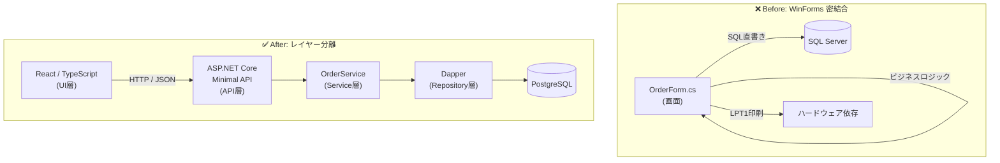
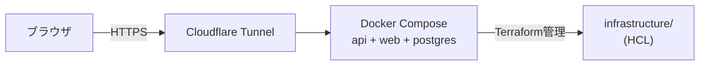

# アーキテクチャ概要

## Before → After

## コンポーネント責務

| コンポーネント | 責務 |
|---|---|
| React (src/Web) | 状態管理・表示のみ。ビジネスロジック不所持 |
| Minimal API (Program.cs) | ルーティング・リクエスト受付 |
| OrderService | 税計算・トランザクション管理・在庫更新 |
| Dapper | パラメータ化クエリによる安全なDBアクセス |
| Docker Compose | 環境依存の排除。ローカル〜本番同一構成 |

## インフラ構成

